# 🧠 LLM Fine-Tuning: Comprehensive Notes

> A structured reference covering LLM fine-tuning strategies, PEFT methods, quantization techniques, and practical tooling — with diagrams, formulas, and paper citations.

---

## 📚 Table of Contents

1. [Why Fine-Tune?](#why-fine-tune)
2. [Fine-Tuning Landscape Overview](#fine-tuning-landscape-overview)
3. [Full Fine-Tuning vs Parameter-Efficient Fine-Tuning](#full-fine-tuning-vs-peft)
4. [Fine-Tuning Techniques](#fine-tuning-techniques)
   - [Supervised Fine-Tuning (SFT)](#supervised-fine-tuning-sft)
   - [RLHF (Reinforcement Learning from Human Feedback)](#rlhf)
   - [DPO (Direct Preference Optimization)](#dpo)
5. [PEFT Methods](#peft-methods)
   - [LoRA](#lora-low-rank-adaptation)
   - [QLoRA](#qlora-quantized-lora)
   - [Other PEFT Variants](#other-peft-variants)
6. [Quantization](#quantization)
   - [Precision Formats](#precision-formats)
   - [Symmetric vs Asymmetric Quantization](#symmetric-vs-asymmetric-quantization)
   - [Post-Training Quantization (PTQ)](#post-training-quantization-ptq)
   - [Quantization-Aware Training (QAT)](#quantization-aware-training-qat)
   - [Modern Quantization Methods](#modern-quantization-methods)
7. [Practical Tooling & Services](#practical-tooling--services)
8. [Key Papers & References](#key-papers--references)

---

## Why Fine-Tune?

A pre-trained LLM (foundation model) is trained on vast general data. Fine-tuning adapts it to:

- Follow instructions / chat format
- Perform domain-specific tasks (medical, legal, code)
- Match a specific tone or persona
- Improve safety and alignment

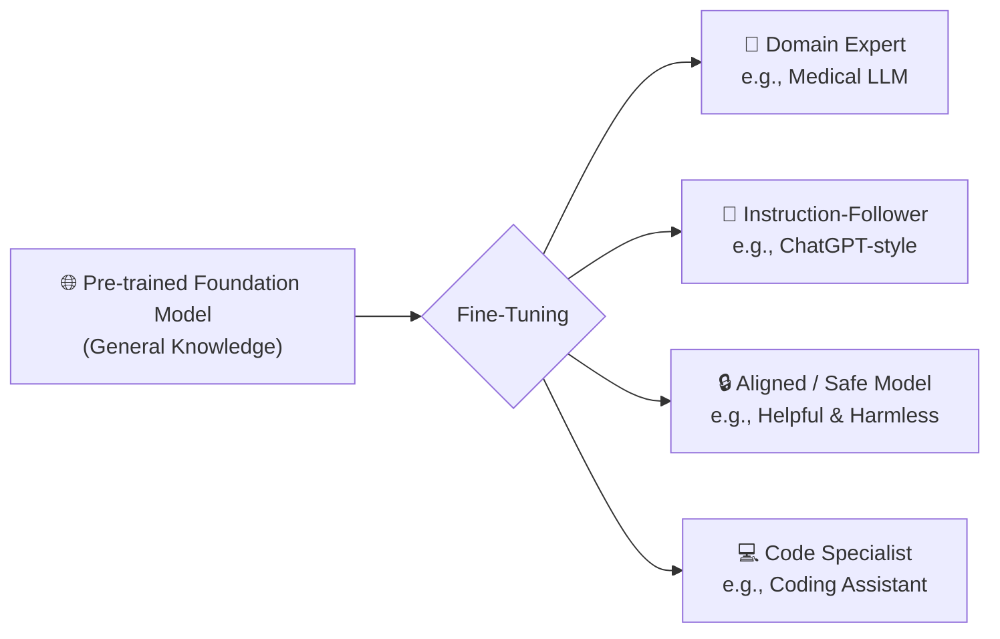

---

## Fine-Tuning Landscape Overview

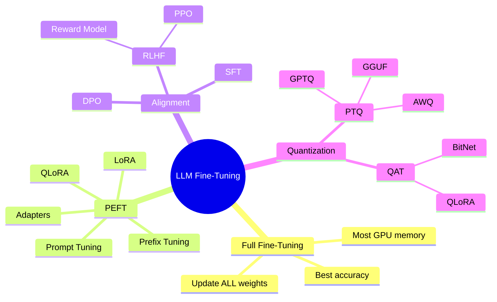

---

## Full Fine-Tuning vs PEFT

| Feature | Full Fine-Tuning | PEFT (e.g., LoRA) |
|---|---|---|
| Parameters Updated | All (~billions) | < 1% of total |
| GPU Memory | Very High | Low |
| Training Speed | Slow | Fast |
| Risk of Catastrophic Forgetting | High | Low |
| Inference Latency | Same as base | Same (adapters merged) |
| Use Case | When you have lots of compute | Most practical scenarios |

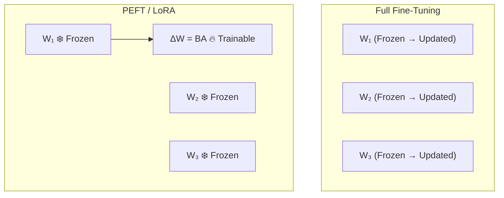

---

## Fine-Tuning Techniques

### Supervised Fine-Tuning (SFT)

The most basic form of fine-tuning. Train the model on **prompt → response** pairs using standard cross-entropy loss.

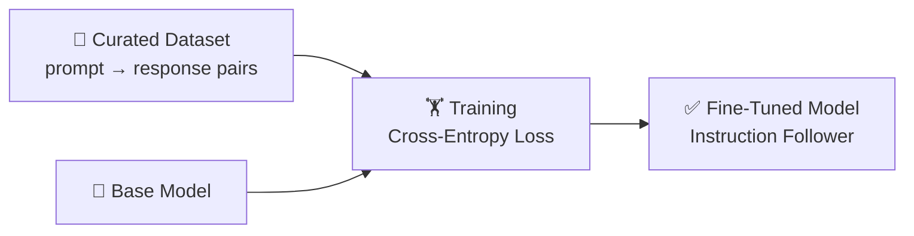

**Best used for:** Teaching the model new formats, tasks, or domain vocabulary.

**Limitation:** Model only imitates examples — doesn't actively optimize for human preference.

---

### RLHF

Reinforcement Learning from Human Feedback — used to align models with human values.

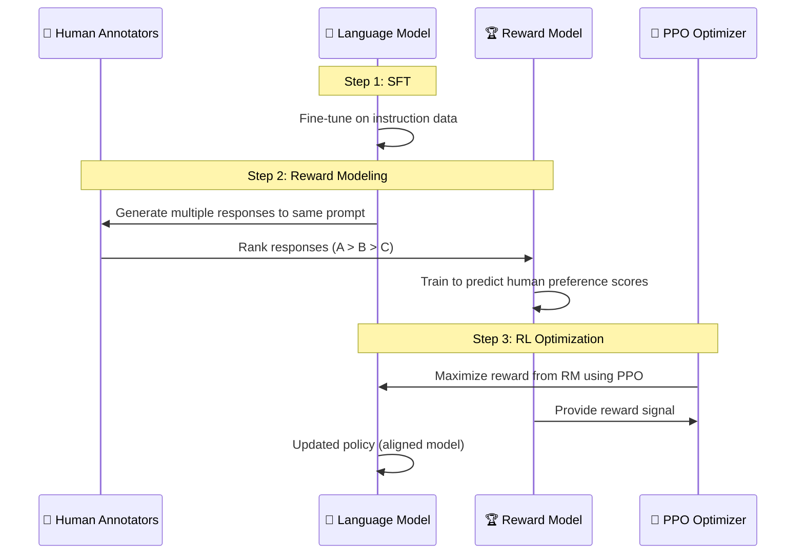

**Pros:** Best for nuanced, subjective alignment.
**Cons:** Very complex — requires training 3 models (SFT, Reward, Policy). Notoriously unstable.

---

### DPO

Direct Preference Optimization — simpler RLHF alternative. No reward model needed.

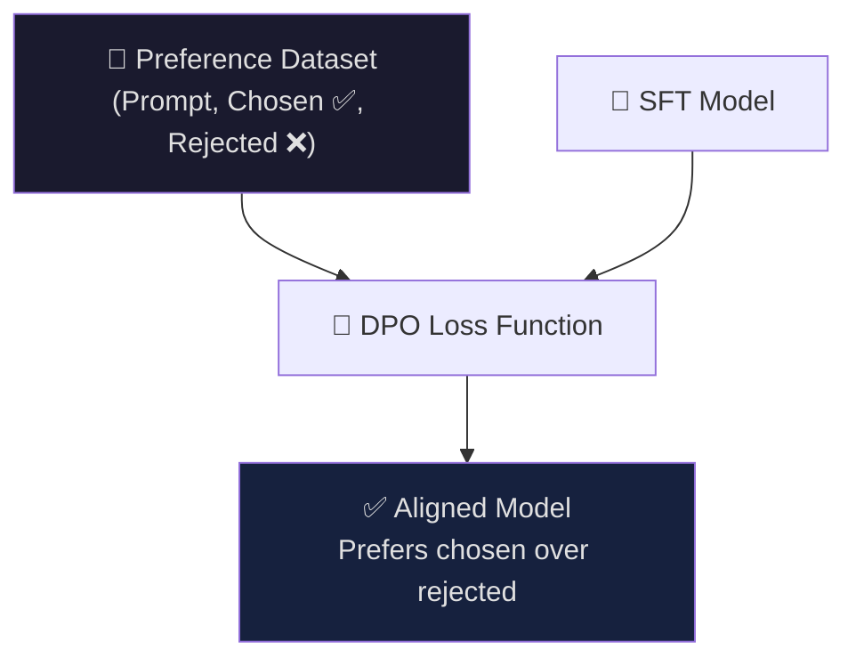

**DPO Loss (simplified):**

$$\mathcal{L}_{DPO} = -\mathbb{E}\left[\log \sigma\left(\beta \log \frac{\pi_\theta(y_w|x)}{\pi_{ref}(y_w|x)} - \beta \log \frac{\pi_\theta(y_l|x)}{\pi_{ref}(y_l|x)}\right)\right]$$

Where `y_w` = chosen (winning) response, `y_l` = rejected (losing) response.

| Technique | Requires Reward Model | Stability | Compute Cost |
|---|---|---|---|
| RLHF / PPO | Yes | Low | Very High |
| DPO | No | High | Moderate |
| SFT | No | Highest | Low |

---

## PEFT Methods

### LoRA: Low-Rank Adaptation

> 📄 **Paper:** [LoRA: Low-Rank Adaptation of Large Language Models](https://arxiv.org/abs/2106.09685) — Hu et al., 2021

**Core Idea:** The weight updates during fine-tuning have a low **intrinsic rank**. Instead of updating the full weight matrix `W`, decompose the update `ΔW` into two small matrices:

$$W' = W + \Delta W = W + BA$$

Where:
- `W ∈ ℝ^{d×k}` — original frozen weight (e.g., 4096 × 4096)
- `B ∈ ℝ^{d×r}` — low-rank matrix (trained from zero)
- `A ∈ ℝ^{r×k}` — low-rank matrix (trained with random Gaussian init)
- `r ≪ min(d, k)` — the rank hyperparameter (typically 4–64)

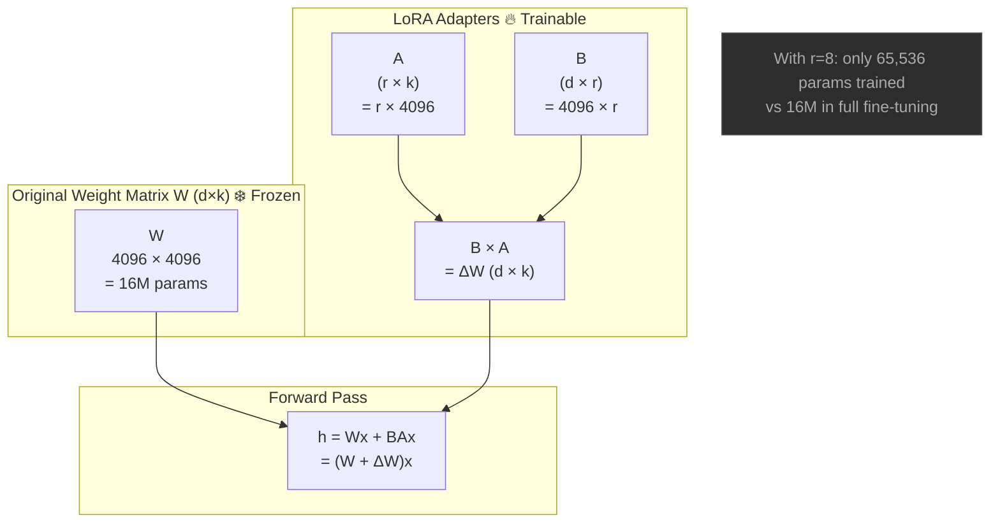

**Key hyperparameters:**
- `r` (rank): lower = fewer params, less expressive. Typical: 8–64
- `alpha (α)`: scaling factor for LoRA update → `ΔW = (α/r) × BA`
- `target_modules`: which layers to apply LoRA (e.g., `q_proj`, `v_proj`, all linear layers)

**No inference overhead:** At deployment, merge `W' = W + BA`. Zero extra latency.

---

### QLoRA: Quantized LoRA

> 📄 **Paper:** [QLoRA: Efficient Finetuning of Quantized LLMs](https://arxiv.org/abs/2305.14314) — Dettmers et al., 2023

QLoRA combines **4-bit quantization** of the base model with **LoRA adapters** for fine-tuning. Enables fine-tuning 70B+ models on a single GPU.

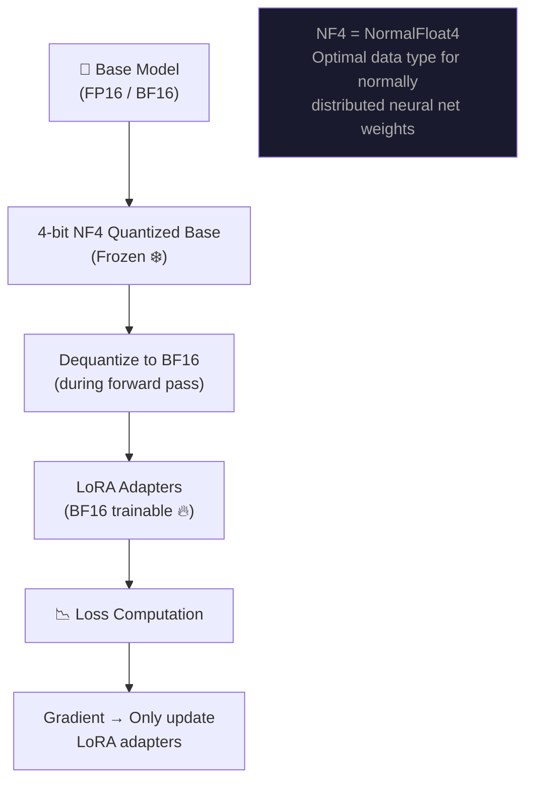

**QLoRA innovations:**
1. **4-bit NormalFloat (NF4)**: Quantization data type optimal for normally distributed weights
2. **Double Quantization**: Quantizes the quantization constants themselves (saves ~0.5 bits/param)
3. **Paged Optimizers**: Uses unified memory to avoid GPU OOM errors during training

**Memory comparison for fine-tuning LLaMA-65B:**

| Method | GPU Memory Required |
|---|---|
| Full Fine-Tuning (BF16) | ~780 GB |
| LoRA (BF16) | ~160 GB |
| QLoRA (4-bit) | ~48 GB (fits on single A100!) |

---

### Other PEFT Variants

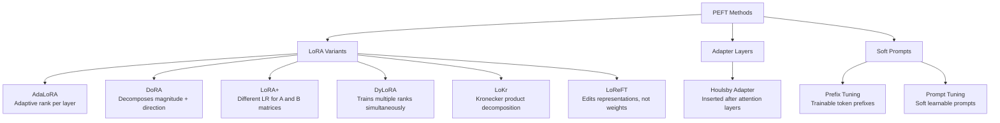

---

## Quantization

Quantization reduces the **numerical precision** of model weights (and sometimes activations) to lower memory footprint and speed up inference.

### Precision Formats

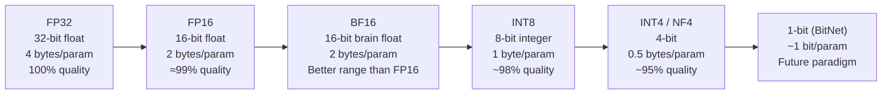

**Rule of thumb:**  
`Model size in GB ≈ (num_parameters × bits_per_param) / (8 × 1024³)`

Example: LLaMA-7B in FP32 = 7 × 10⁹ × 4 / 1e9 ≈ **28 GB**. In 4-bit: ≈ **3.5 GB**.

---

### Symmetric vs Asymmetric Quantization

#### Symmetric Quantization

Maps the float range `[-α, α]` symmetrically around zero to `[-2^(b-1), 2^(b-1) - 1]`.

$$Q(x) = \text{round}\left(\frac{x}{S}\right), \quad S = \frac{\alpha}{2^{b-1} - 1}$$

- Scale factor `S` is shared for both positive and negative values
- Zero-point = 0 (simplifies computation)
- Used in: Batch Normalization, standard conv layers

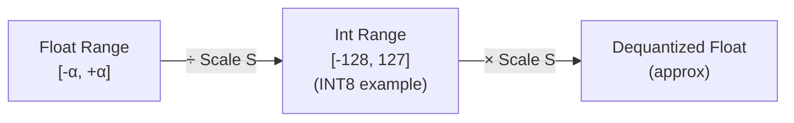

#### Asymmetric Quantization

Maps any float range `[β_min, β_max]` to `[0, 2^b - 1]` using both **scale** and **zero-point**.

$$Q(x) = \text{round}\left(\frac{x}{S}\right) + Z$$
$$S = \frac{\beta_{max} - \beta_{min}}{2^b - 1}, \quad Z = -\text{round}\left(\frac{\beta_{min}}{S}\right)$$

- Handles non-symmetric distributions (e.g., ReLU outputs which are all positive)
- More accurate for activations
- Slight extra cost for zero-point arithmetic

| | Symmetric | Asymmetric |
|---|---|---|
| Zero-point | 0 | Non-zero offset |
| Best for | Weights, Conv layers | Activations (ReLU outputs) |
| Computation | Simpler | Slightly more complex |
| Formula similarity | Min-Max Scaler centered | Shifted Min-Max Scaler |

---

### Post-Training Quantization (PTQ)

Quantize a fully pre-trained model **without any additional training**.

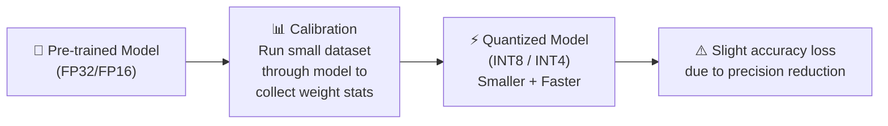

**Calibration** is the key step: a small representative dataset (~512 samples) is run through the model to gather activation statistics (min/max, distribution), enabling better quantization boundaries.

**Common PTQ Methods:**

| Method | Bits | Approach | Notes |
|---|---|---|---|
| **GPTQ** | 4-bit | Layer-wise, second-order (Hessian) | Most popular INT4 PTQ |
| **AWQ** | 4-bit | Weights scaled by activation importance | Better than GPTQ on edge cases |
| **GGUF** (llama.cpp) | 2–8 bit | K-Quants format, CPU-optimized | Standard for local deployment |
| **bitsandbytes** | 8 or 4 bit | NF4/INT8, fast, GPU-based | Used by HuggingFace |

#### GPTQ Deep-Dive

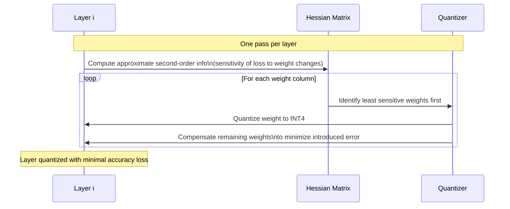

---

### Quantization-Aware Training (QAT)

Train (or fine-tune) the model **while simulating quantization** during the forward pass.

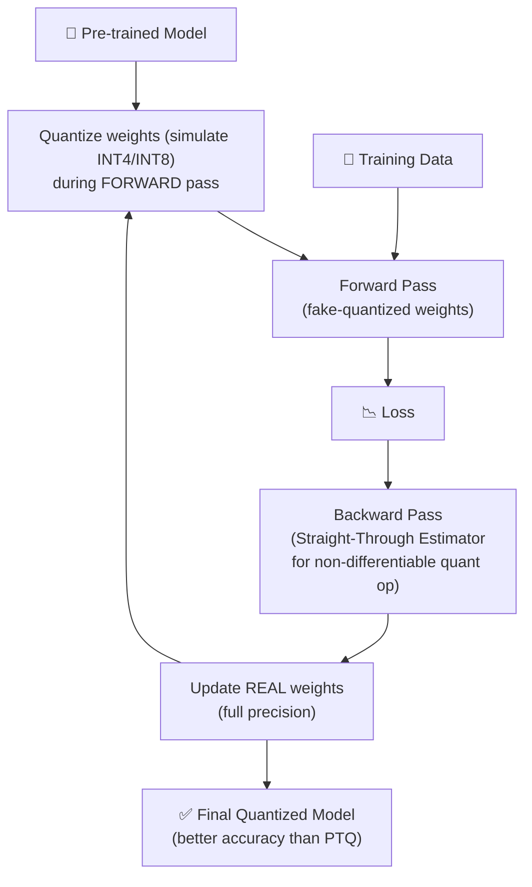

**Straight-Through Estimator (STE):** Since `round()` has zero gradient, QAT uses STE to pass gradients through the quantization operation as if it were identity during backprop.

---

### Modern Quantization Methods

#### BitNet / BitNet b1.58

> 📄 **Paper:** [The Era of 1-bit LLMs: All Large Language Models are in 1.58 Bits](https://arxiv.org/abs/2402.17764) — Ma et al., 2024 (Microsoft Research)

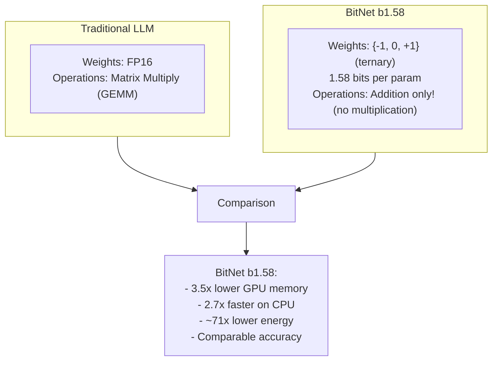

BitNet b1.58 trains **natively** in low precision rather than compressing after training. Every weight takes a value of `-1`, `0`, or `+1` — enabling matrix multiplication to become pure addition.

---

## Practical Tooling & Services

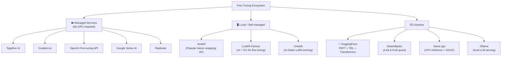

### Typical QLoRA Fine-Tuning Pipeline

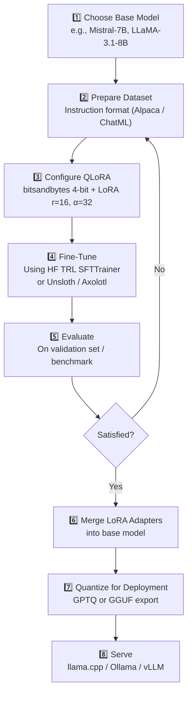

---

## Key Papers & References

| Paper | Year | Key Contribution | Link |
|---|---|---|---|
| **LoRA** — Hu et al. | 2021 | Low-rank weight decomposition for efficient fine-tuning | [arxiv.org/abs/2106.09685](https://arxiv.org/abs/2106.09685) |
| **QLoRA** — Dettmers et al. | 2023 | 4-bit quantized base + LoRA adapters, NF4 datatype | [arxiv.org/abs/2305.14314](https://arxiv.org/abs/2305.14314) |
| **RLHF** — Ouyang et al. (InstructGPT) | 2022 | RLHF pipeline for alignment (basis of ChatGPT) | [arxiv.org/abs/2203.02155](https://arxiv.org/abs/2203.02155) |
| **DPO** — Rafailov et al. | 2023 | Direct preference optimization, RLHF without reward model | [arxiv.org/abs/2305.18290](https://arxiv.org/abs/2305.18290) |
| **GPTQ** — Frantar et al. | 2022 | Layer-wise 4-bit post-training quantization | [arxiv.org/abs/2210.17323](https://arxiv.org/abs/2210.17323) |
| **BitNet b1.58** — Ma et al. | 2024 | 1.58-bit native LLM training ({-1,0,1} weights) | [arxiv.org/abs/2402.17764](https://arxiv.org/abs/2402.17764) |
| **DoRA** — Liu et al. | 2024 | Weight-decomposed LoRA (magnitude + direction) | [arxiv.org/abs/2402.09353](https://arxiv.org/abs/2402.09353) |
| **AdaLoRA** — Zhang et al. | 2023 | Adaptive rank allocation across layers | [arxiv.org/abs/2303.10512](https://arxiv.org/abs/2303.10512) |
| **LLaMA-2** — Touvron et al. | 2023 | Open-source foundation model with RLHF | [arxiv.org/abs/2307.09288](https://arxiv.org/abs/2307.09288) |
| **Mistral-7B** — Jiang et al. | 2023 | Efficient 7B model with sliding window attention | [arxiv.org/abs/2310.06825](https://arxiv.org/abs/2310.06825) |

---

## Notebooks in This Repo

| Notebook | Description |
|---|---|
| [`Fine_Tuning_LLm_Models.ipynb`](./Fine_Tuning_LLm_Models.ipynb) | General LLM fine-tuning walkthrough |
| [`Fine_Tuning_with_Mistral_QLora_PEFt.ipynb`](./Fine_Tuning_with_Mistral_QLora_PEFt.ipynb) | Mistral + QLoRA + PEFT end-to-end |
| [`Fine_tune_Llama_2.ipynb`](./Fine_tune_Llama_2.ipynb) | LLaMA-2 fine-tuning |
| [`fine-tune-llama-3-1-step-by-step-guide.ipynb`](./fine-tune-llama-3-1-step-by-step-guide.ipynb) | LLaMA 3.1 step-by-step guide |
| [`lora_tuning.ipynb`](./lora_tuning.ipynb) | LoRA adapter training deep-dive |

---

## Quick Reference: Choosing a Strategy

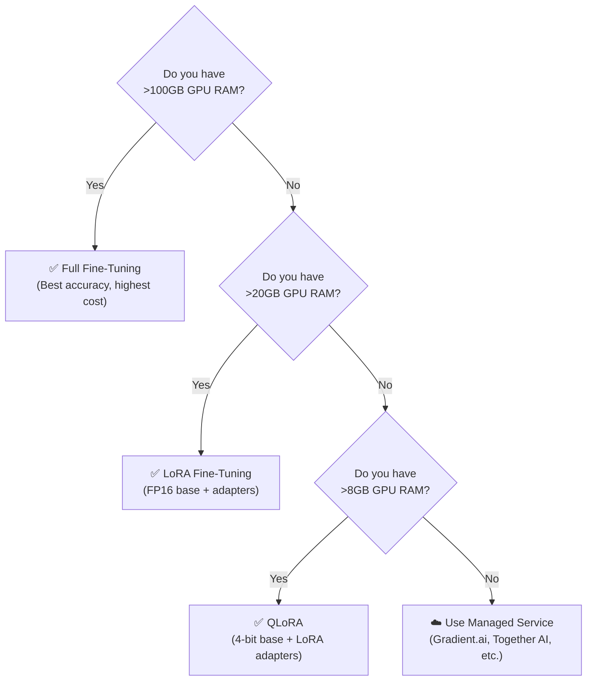

---

## 🔬 Transformer Architecture: "Attention Is All You Need"

> 📄 **Paper:** [Attention Is All You Need](https://arxiv.org/abs/1706.03762) — Vaswani et al., NeurIPS 2017  
> This paper introduced the **Transformer**, the foundational architecture powering every modern LLM (GPT, LLaMA, Mistral, BERT, etc.).

**Why it mattered:** Replaced RNNs/LSTMs entirely with a pure-attention mechanism. Fully parallelizable — no sequential bottleneck during training.

---

### High-Level Architecture

The original Transformer is an **Encoder–Decoder** model (for seq2seq tasks like translation). Modern LLMs typically use **Decoder-only** variants.

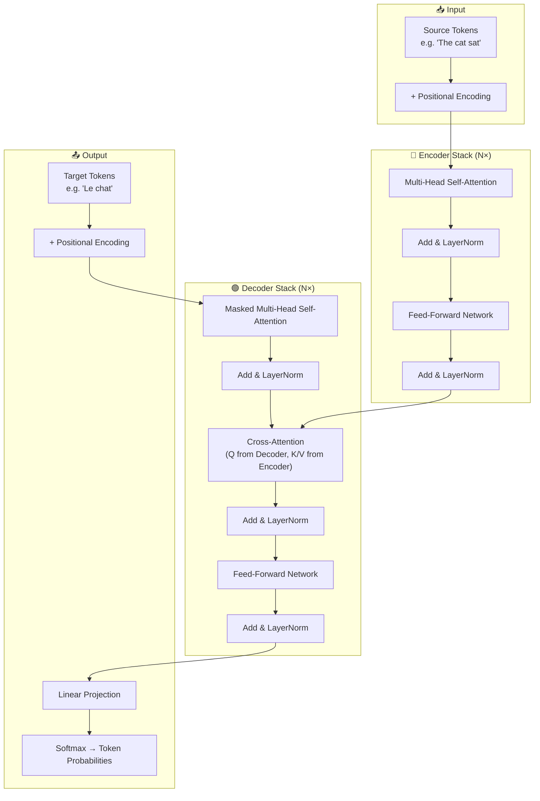

---

### The Three Variants Used Today

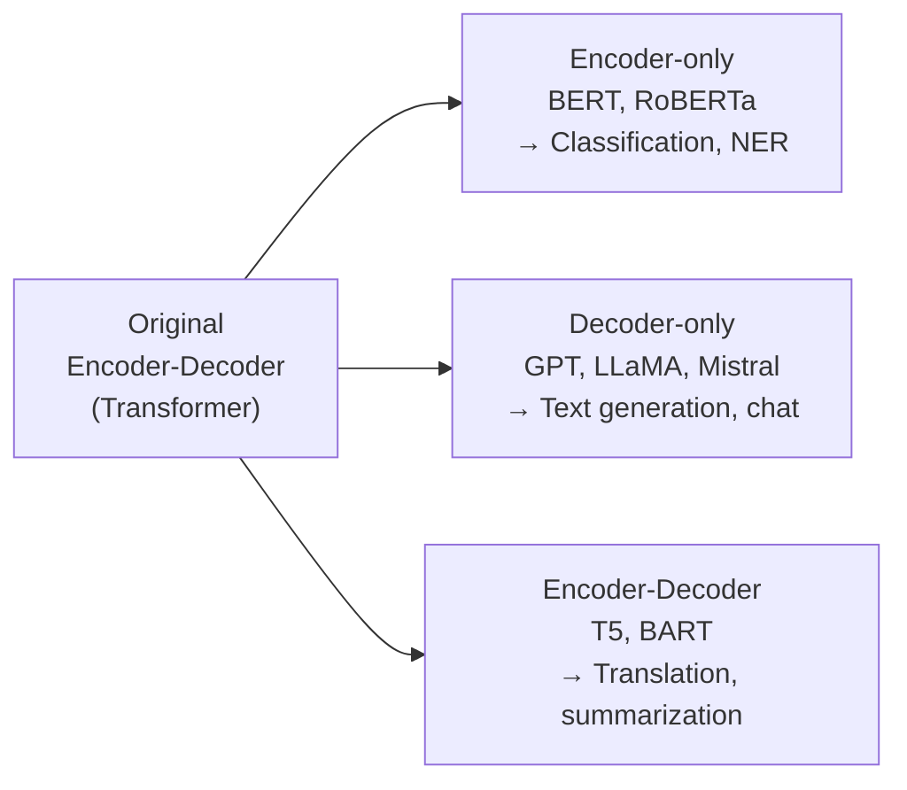

---

### Scaled Dot-Product Attention

The **fundamental building block** of every Transformer layer.

**Formula:**
$$\text{Attention}(Q, K, V) = \text{softmax}\!\left(\frac{QK^T}{\sqrt{d_k}}\right) V$$

```mermaid
flowchart TD
    Q["Q (Query)\nWhat am I looking for?"] --> DOT["QKᵀ\nDot Product\n(similarity scores)"]
    K["K (Key)\nWhat does each token offer?"] --> DOT
    DOT --> SCALE["÷ √dₖ\nScale\n(prevent vanishing gradients)"]
    SCALE --> MASK["Optional Mask\n(Decoder: hide future tokens)"]
    MASK --> SM["Softmax\nConvert to attention weights\n(sum to 1)"]
    SM --> WMUL["× V (Values)\nWeighted sum of values"]
    V["V (Value)\nActual content to aggregate"] --> WMUL
    WMUL --> OUT["Output\nContext-aware token representation"]
```

**Why divide by √dₖ?**  
With large `d_k`, the dot product `QKᵀ` can grow very large, pushing softmax into near-zero gradient regions. Dividing by √dₖ keeps the variance at ~1.

**Q, K, V intuition:**

| Symbol | Analogy | Role |
|---|---|---|
| **Q** (Query) | Search query | "What am I looking for?" |
| **K** (Key) | Index/tag | "What does this token offer?" |
| **V** (Value) | Document content | "What is the information to pass forward?" |

---

### Multi-Head Attention

Instead of one attention function, run `h` attention heads **in parallel**, each with its own learned `W_Q`, `W_K`, `W_V` projections.

$$\text{MultiHead}(Q,K,V) = \text{Concat}(\text{head}_1, \ldots, \text{head}_h)\, W^O$$
$$\text{head}_i = \text{Attention}(QW_i^Q,\; KW_i^K,\; VW_i^V)$$

```mermaid
graph TD
    IN["Input Embeddings\n(seq_len × d_model)"] --> H1["Head 1\nW_Q¹, W_K¹, W_V¹\n→ Attention"]
    IN --> H2["Head 2\nW_Q², W_K², W_V²\n→ Attention"]
    IN --> H3["Head 3\n..."]
    IN --> HN["Head h\nW_Qʰ, W_Kʰ, W_Vʰ\n→ Attention"]
    H1 --> CONCAT["Concat all heads\n(seq_len × h·d_v)"]
    H2 --> CONCAT
    H3 --> CONCAT
    HN --> CONCAT
    CONCAT --> WO["× W_O (output projection)\n→ (seq_len × d_model)"]
    WO --> RES["Residual + LayerNorm"]
```

**Why multiple heads?**  
Each head can learn to attend to different aspects simultaneously:
- Head 1 → syntactic relationships (subject-verb)
- Head 2 → coreference (pronoun → noun)
- Head 3 → long-range dependencies
- etc.

**Original paper hyperparameters:** `h = 8`, `d_model = 512`, `d_k = d_v = 64`

---

### Positional Encoding

Transformers process all tokens **in parallel** — no inherent sense of order. Positional encodings inject position information by adding a fixed vector to each token embedding.

**Sinusoidal formulas (from the paper):**
$$PE_{(pos,\, 2i)} = \sin\!\left(\frac{pos}{10000^{2i/d_{model}}}\right)$$
$$PE_{(pos,\, 2i+1)} = \cos\!\left(\frac{pos}{10000^{2i/d_{model}}}\right)$$

```mermaid
graph LR
    TOK["Token Embedding\n'cat' → [0.2, -0.5, ...]"] --> ADD_PE["⊕ Add"]
    POS["Positional Encoding\npos=3 → [sin(...), cos(...), ...]"] --> ADD_PE
    ADD_PE --> LAYER["Input to Transformer Layer\n(has both meaning + position)"]
```

**Modern variants replacing sinusoidal PE:**

| Method | Used in | Key idea |
|---|---|---|
| Sinusoidal (fixed) | Original Transformer | Deterministic, extrapolates to unseen lengths |
| Learned Absolute | GPT-2, BERT | Learned embeddings per position |
| **RoPE** (Rotary) | LLaMA, Mistral, GPT-NeoX | Encodes relative position via rotation matrices |
| **ALiBi** | MPT, BLOOM | Adds position bias to attention scores (no extra params) |

---

### Transformer Block (Single Layer)

```mermaid
flowchart TD
    X["xₗ (input to layer l)"] --> MHA["Multi-Head Attention\n(Self or Cross)"]
    MHA --> ADD1["✚ Residual Connection"]
    X --> ADD1
    ADD1 --> LN1["LayerNorm"]
    LN1 --> FFN["Feed-Forward Network\nFFN(x) = max(0, xW₁+b₁)W₂+b₂\nd_ff = 2048 (4× d_model)"]
    FFN --> ADD2["✚ Residual Connection"]
    LN1 --> ADD2
    ADD2 --> LN2["LayerNorm"]
    LN2 --> OUT["xₗ₊₁ (output of layer l)"]
```

The **residual connections** (`x + Sublayer(x)`) ensure gradients flow cleanly through all N layers, making deep stacks (~96 layers in GPT-3) trainable.

---

### Scaling: From Small to Large Models

```mermaid
graph LR
    SMALL["Small Transformer\nd_model=512, h=8, N=6\n(Original paper: ~65M params)"] --> MED["GPT-2\nd_model=1600, h=25, N=48\n~1.5B params"]
    MED --> LARGE["GPT-3\nd_model=12288, h=96, N=96\n~175B params"]
    LARGE --> XL["LLaMA-3.1 405B\nd_model=16384, h=128, N=126\n~405B params"]
```

**Scaling laws (Kaplan et al., 2020):** Model performance improves predictably as a power law with compute, data, and parameters. This insight drove the race to larger models.

**Key differences in modern LLMs vs original Transformer:**

| Feature | Original (2017) | Modern LLMs (e.g., LLaMA) |
|---|---|---|
| Architecture | Encoder-Decoder | Decoder-only |
| Positional Encoding | Sinusoidal | RoPE |
| Normalization | Post-LayerNorm | Pre-LayerNorm (more stable) |
| Activation | ReLU | SwiGLU / GELU |
| Attention | Standard | Grouped Query Attention (GQA) |
| Context Length | 512 tokens | 8K–128K+ tokens |

---

### Attention Variants in Modern LLMs

```mermaid
graph TD
    MHA_classic["Multi-Head Attention (MHA)\nOriginal: each head has its own K,V\nHighest quality, highest memory"] --> MQA["Multi-Query Attention (MQA)\nAll heads share ONE K,V set\nFastest, lower quality (Falcon)"]
    MHA_classic --> GQA["Grouped-Query Attention (GQA)\nGroups of heads share K,V\nBest speed-quality balance\n(LLaMA-2 70B, Mistral, Gemma)"]
```

GQA reduces the **KV-cache** size during inference — critical for serving long contexts efficiently.

---

### Connection to Fine-Tuning

Understanding the Transformer is essential for fine-tuning because:

```mermaid
graph TD
    TL["Transformer Layer"] --> ATT["Attention: W_Q, W_K, W_V, W_O\n← LoRA targets these"]
    TL --> FFN2["FFN: W_up, W_gate, W_down\n← LoRA can target these too"]
    ATT --> LORA_APP["LoRA adds ΔW = BA\nto selected weight matrices\nwithout touching frozen base weights"]
    FFN2 --> LORA_APP
```

LoRA typically targets **`q_proj`** and **`v_proj`** (the Query and Value projection matrices in attention), as these have the highest impact on the model's behavior with the fewest parameters.

---

*Last updated: March 2026*
